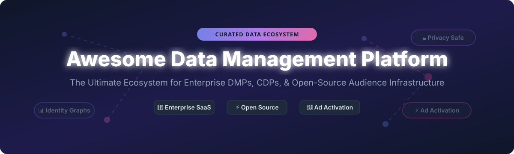

<p align="center">
  
</p>

# 🚀 Awesome Data Management Platform (DMP) Ecosystem 📊

<p align="center">
  <a href="https://github.com/ishandutta2007/Awesome-Awesome-Awesome"></a><a href="https://discord.gg/jc4xtF58Ve"></a>
  <a href="https://github.com/ishandutta2007/Awesome-Data-Management-Platform/stargazers"></a>
  <a href="https://github.com/ishandutta2007/Awesome-Data-Management-Platform/network/members"></a>
  <a href="https://github.com/ishandutta2007/Awesome-Data-Management-Platform/issues"></a>
  <a href="https://github.com/ishandutta2007/Awesome-Data-Management-Platform/blob/main/LICENSE"></a>
  <a href="https://github.com/ishandutta2007"></a>
</p>

**Curated List of Enterprise SaaS Products & Open-Source GitHub Projects for Audience Data, Customer Data Platforms (CDP), Identity Graphs, & Ad Activation.**

---

## 📌 Overview & Scope

Welcome to the **Awesome Data Management Platform (DMP)** repository! 🌟 This project provides a comprehensive, SEO-optimized directory of modern **Data Management Platforms (DMPs)**, **Customer Data Platforms (CDPs)**, and **open-source behavioral data pipelines**.

Traditional DMPs collect, structure, and activate anonymous or pseudonymous audience data across advertising ecosystems—primarily utilizing first-party identifiers, device graphs, second-party data clean rooms, and third-party data marketplaces. As the digital advertising landscape shifts away from third-party cookies toward privacy-first models (GDPR, CCPA/CPRA, Apple ATT), modern DMPs have evolved alongside enterprise CDPs to provide unified identity resolution and real-time ad activation pipelines.

---

## 📑 Table of Contents

- [🏢 SaaS & Enterprise Hosted Platforms](#-saas--enterprise-hosted-platforms)
- [💻 Open-Source GitHub Projects](#-open-source-github-projects)
- [🏗️ Architectural Blueprints & Patterns](#%EF%B8%8F-architectural-blueprints--patterns)
- [🤝 How to Contribute](#-how-to-contribute)
- [💖 Support & Sponsorship](#-support--sponsorship)
- [📈 Star History](#-star-history)
- [⚠️ Disclaimer](#%EF%B8%8F-disclaimer)

---

## 🏢 SaaS & Enterprise Hosted Platforms

> 💡 **Market Size & Structure Note:**  
> The global Data Management Platform (DMP) and Customer Data Platform (CDP) market is estimated at **\$3.5 Billion – \$5.2 Billion** (growing at a ~18% CAGR toward \$15B+ by 2030). The market is **moderately fragmented**: mega-cap cloud suites (Salesforce, Adobe, Oracle) control enterprise suite budgets, while specialized ad-tech providers (Lotame, Permutive, Zeotap) lead cookieless publisher infrastructure and identity resolution niche segments.

The table below details top commercial DMPs and enterprise CDPs sorted by **Company Size (Revenue / Market Capitalization)** in descending order:

| Vendor / Platform 🏢 | Company Size 💰 | Pricing Model 🏷️ | Free Tier / Trial Limit 🎁 | Key Audience & Activation Capabilities ⚡ |
| :--- | :--- | :--- | :--- | :--- |
| **[Salesforce Data Cloud](https://www.salesforce.com/data/)** | **\$190B+ Market Cap** | Starts at \$108,000/year (or consumption credits from \$2,160/month) | 🎁 Free Developer Edition with up to 10,000 unified customer profiles | Enterprise CDP & real-time DMP replacement fully integrated into Salesforce CRM stack. |
| **[Adobe Audience Manager](https://business.adobe.com/products/audience-manager.html)** | **\$175B+ Market Cap** (Adobe Inc.) | Custom contract (typically starts at \$60,000–\$150,000/year) | 🎁 30-day enterprise sandbox trial via Adobe Experience Cloud sales demo | Enterprise DMP for audience building, lookalike modeling, and Adobe Cloud activation. |
| **[Oracle BlueKai](https://www.oracle.com/)** | **\$380B+ Market Cap** (Oracle Corp.) | Custom enterprise contract (starts at ~\$50,000/year) | 🎁 30-day Free Trial with \$300 Oracle Cloud Infrastructure credits | Legacy enterprise DMP for third-party audience targeting and ad activation pipelines. |
| **[Nielsen Marketing Cloud](https://www.nielsen.com/)** | **\$15B+ Enterprise Value** | Custom enterprise contract (starts at ~\$40,000/year) | 🎁 14-day guided proof-of-concept trial upon demo request | Nielsen-powered demographic audience insights, measurement, and TV/digital activation. |
| **[Treasure Data](https://www.treasuredata.com/)** | **~\$125M Annual Revenue** | Custom profile/event licensing (starts at \$3,500/month or \$42,000/year) | 🎁 14-day full enterprise feature trial upon sales demo approval | Enterprise CDP/DMP with "No Compute" pricing model for large-scale customer data unification. |
| **[Lotame](https://www.lotame.com/)** | **~\$125M Annual Revenue** | Custom platform fee + data CPM (starts at \$2,500/month) | 🎁 30-day Spherical platform demo trial with sample data access | Independent DMP & identity platform for 1st/2nd/3rd party audience data activation. |
| **[Permutive](https://permutive.com/)** | **~\$350M Valuation** | Custom publisher contract (starts at ~\$3,000/month based on monthly pageviews) | 🎁 14-day publisher trial sandbox for cookieless cohort testing | Edge-based publisher DMP optimized for privacy-first, cookieless audience monetization. |
| **[Zeotap](https://zeotap.com/)** | **~\$180M Valuation** | Custom module subscription (starts at ~\$2,000/month) | 🎁 14-day customer intelligence platform trial | Privacy-centric CDP & identity graph designed for European GDPR-compliant activation. |
| **[Commanders Act](https://www.commandersact.com/)** | **~\$20M Annual Revenue** | Business plan starts at €800/month (~\$870/month) | 🎁 14-day free trial for consent management & audience tag suite | European consent management (CMP) & privacy-safe customer data activation platform. |
| **[Relay42](https://relay42.com/)** | **~\$10M Annual Revenue** | Custom journey tier (starts at ~\$1,500/month) | 🎁 14-day customer journey orchestration sandbox trial | Real-time customer data & journey orchestration platform for omni-channel activation. |

---

## 💻 Open-Source GitHub Projects

While end-to-end commercial DMPs handle direct ad-network CPM integrations and third-party data marketplaces, the open-source community provides powerful building blocks for **first-party event tracking**, **warehouse-first CDPs**, **customer profile stores**, and **analytics data platforms**.

The projects below are sorted by **GitHub Stars** in descending order:

| Project 📦 | GitHub Stars ⭐ | License 📜 | Ecosystem Role 🎯 | Key Features & Architecture 🛠️ |
| :--- | :--- | :--- | :--- | :--- |
| **[PostHog](https://github.com/PostHog/posthog)** | [](https://github.com/PostHog/posthog/stargazers) | MIT | All-in-one Product OS & CDP | Self-hosted analytics, event ingestion, cohort segmentation, and feature flags. |
| **[Matomo](https://github.com/matomo-org/matomo)** | [](https://github.com/matomo-org/matomo/stargazers) | GPL-3.0 | First-Party Web Analytics | Privacy-compliant Google Analytics alternative providing rich audience logs without third-party cookies. |
| **[Snowplow](https://github.com/snowplow/snowplow)** | [](https://github.com/snowplow/snowplow/stargazers) | Apache-2.0 / PolyForm | Enterprise Behavioral Data Pipeline | High-throughput event collection pipeline for feeding Snowflake, BigQuery, and Databricks warehouses. |
| **[CKAN](https://github.com/ckan/ckan)** | [](https://github.com/ckan/ckan/stargazers) | AGPL-3.0 | Open Data Management Portal | Open data portal software for organizing, publishing, and sharing large public or enterprise datasets. |
| **[Jitsu](https://github.com/jitsucom/jitsu)** | [](https://github.com/jitsucom/jitsu/stargazers) | MIT | Warehouse-First Event Data Pipeline | Lightweight open-source alternative to Segment for streaming event logs into data warehouses. |
| **[RudderStack Core](https://github.com/rudderlabs/rudder-server)** | [](https://github.com/rudderlabs/rudder-server/stargazers) | SSPL | Customer Data Pipeline Engine | High-performance customer data engine for routing events to 150+ destination tools. |
| **[Houseware](https://github.com/houseware-hq/houseware)** | [](https://github.com/houseware-hq/houseware/stargazers) | Apache-2.0 | Warehouse-Native Data App Framework | Builds product analytics and audience cohorting directly on top of cloud data warehouses. |
| **[Apache Unomi](https://github.com/apache/unomi)** | [](https://github.com/apache/unomi/stargazers) | Apache-2.0 | Open-Source CDP Reference Engine | Java-based OASIS Customer Data Platform specification implementation for profile management. |

---

## 🏗️ Architectural Blueprints & Patterns

### 🔄 The Modern First-Party Open DMP Stack

Organizations seeking full control over user privacy and raw event data often construct a **Composable DMP Stack** using open-source engines and cloud warehouses:

```
+------------------------+      +--------------------------+      +---------------------------+
|   Event Collection     | ---> |   Data Warehouse / Lake  | ---> |   Profile & Segmentation  |
| (Snowplow / Jitsu)     |      | (Snowflake/BigQuery/dbt) |      | (Apache Unomi / PostHog)  |
+------------------------+      +--------------------------+      +---------------------------+
                                                                                |
                                                                                v
                                                                  +---------------------------+
                                                                  |  Ad Activation & Clean Room|
                                                                  | (Reverse ETL / Custom API)|
                                                                  +---------------------------+
```

---

## 🤝 How to Contribute

Contributions are warmly welcomed! 💖 Help make this repository the definitive resource for data management platforms:

1. **Fork** the repository.
2. Create a feature branch (`git checkout -b add-new-dmp-tool`).
3. Add your entry to `README.md` following the tabular formatting.
4. Ensure factual accuracy regarding licensing, star counts, and features.
5. Submit a **Pull Request** with a brief summary of additions.

For more awesome open-source collections, check out the main [Awesome-Awesome-Awesome](https://github.com/ishandutta2007/Awesome-Awesome-Awesome) hub! 🌟

---

## 💖 Support & Sponsorship

If you find this repository helpful for your data team, research, or ad-tech engineering projects, please consider supporting the project! 🌟

- ⭐ **Star** this repository to increase visibility.
- 🔀 **Fork** it to keep your own copy or contribute back.
- 📢 **Share** it with your ad-tech and data platform colleagues.
- ☕ **Buy me a coffee / Sponsor**: If you'd like to support ongoing maintenance and curated open-source projects, visit the [GitHub Sponsor Dashboard](https://github.com/sponsors/ishandutta2007)!

<p align="center">
  <a href="https://github.com/sponsors/ishandutta2007">
    
  </a>
</p>

---

## 📈 Star History

[](https://star-history.dera.page/#ishandutta2007/Awesome-Data-Management-Platform&type=date&legend=top-left)

---

## ⚠️ Disclaimer

- This is a **community-curated framework** intended for informational and educational purposes.
- Audience targeting, identity graphs, and behavioral tracking are governed by regional data protection regulations (GDPR, CCPA, CPRA, ePrivacy Directive, LGPD). Ensure proper consent and legal compliance prior to deploying data pipelines.
- Product logos and brand names are trademarks of their respective owners.

---

<p align="center">
  <b>Made with ❤️ for Ad-Tech Engineers, Data Platform Architects, & Privacy-First Teams.</b>
</p>
